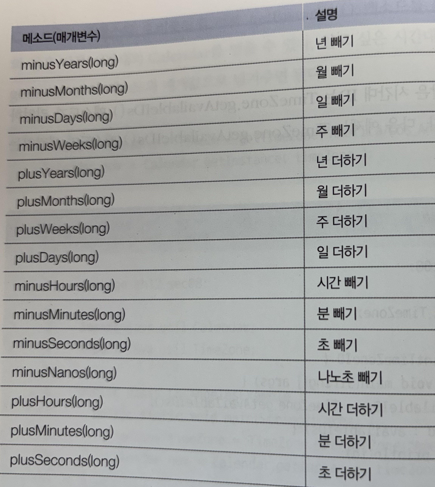
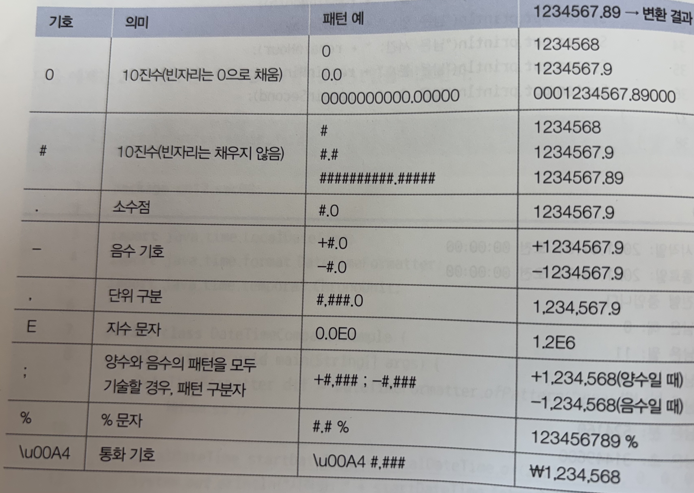
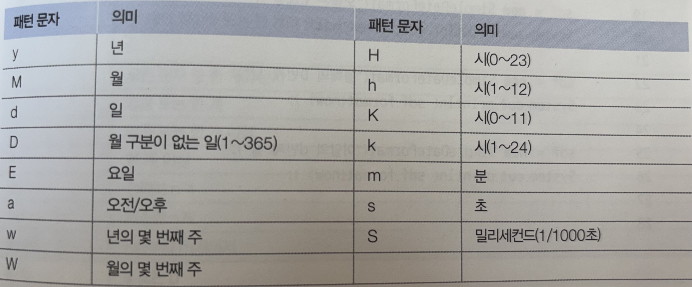

# 12 java.base 모듈

## 12.1 API 도큐먼트

- 라이브러리가 클래스와 인터페이스의 집합이라면 API도큐먼트는 이를 사용하기 위한 방법을 기술한 것이다.
- [API 도큐먼트 링크](https://docs.oracle.com/en/java/javase/index.html)

## 12.2 java.base 모듈

- java.base는 모든 모듈이 의존하는 기본 모듈로 유일하게 `requires` 하지 않아도 사용할 수 있다.


## 12.3 Object 클래스

- 클래스를 선언할 때 `extends` 키워드로 다른 클래스를 상속하지 않으면 암시적으로 `java.lang.Object`클래스를 상속하게 된다
- 따라서 모든 클래스는 `Object` 클래스의 자식이거나 자손 클래스이다.
- `Object` 클래스가 가지고 있는 주요 메소드
  - `boolean equals(Object obj)` : 객체의 번지를 비교하고 결과를 리턴
  - `int hashCode()` : 객체의 해시코드를 리턴
  - `String toString()` : 객체의 문자 정보를 리턴
- 일반적으로 `Object`의 `equals`메소드는 재정의 해서 동등 비교용으로 사용된다

```java
Object obj1 = new Object();
Object Obj2  = new Object();
boolean result1  = obj1.equals(obj2);
boolean result2 = (obj1==obj2);
//result1 과 result2는 결과가 동일함
```

### 객체 해시코드

- 객체 해시코드란 객체를 식별하는 정수를 말한다.
- `Object`의 `hashCode`메소드는 객체의 메모리 번지를 이용해서 해시코드를 생성하기 때문에 객체마다 다른 정수값을 리턴한다.
- 메소드의 용도는 `equals`메소드와 비슷한데 두 객체가 동등한지 비교할 때 주로 사용된다
- [예제](/src/ch12/sec03/exam02/Student.java)

### 객체 문자 정보

- `Object`의 `toString()` 메소드는 객체의 문자 정보(기본적으로 **클래스명@16진수해시코드**)로 구성된 문자열을 리턴한다.
- 객체의 문자정보가 중요한 경우에는 `Object의 `의 `toString()` 메소드를 재정의해서 간결하고 유익한 정보를 리턴하도록 변경할 수 있다.

### 레코드 선언

- 데이터 전달을 위한 `DTO(Data transfer Object)`를 작성할 때 반복적으로 사용되는 코드를 줄이기 위해 Java 14부터 **레코드(record)** 가 도입되었다.

```java

/**
 * 1. 읽기만 가능한 필드
*2. 필드이름과 동일한 Getter 메소드
*3. 동등 비교를 위해 hashCode(),equals()메소드 재정의
*4. 문자열 출력을 위한 toString()메소드 재정의
*/

public class Person{
private final String name;
private final int age;

public Person(String name,int age) {
    this.name=name;
    this.age= age;
}

public String name() {return this.name;}
public int age() {return this.age;}

@Override
public int hashCode{...}

@Override
public boolean equals(Object obj){...}

@Override
public String toString(){...}
}

```

- 다음 코드는 위와 동일한 코드를 선언하는 레코드 선언이다.

```java

public record Person(String name, int age){}
```

### 롬복

- `lombok(롬복)`은 JDK에 포함된 표준 라이브러리는 아니지만 개발자들이 즐겨쓰는 자동 코드생성 라이브러리이다.
- `dto`클래스를 작성할때 Getter,Setter,hashCode(),equals(),toString()메소드를 자동 생성한다.
- `record`와의 차이점은 필드가 `final`이 아니며 값을 읽는 getter ,setter는 각각 `getXXX()`,`setXXX()`,`isXXX()` 로 명명된다.
- [lombok 예시](/src/ch12/sec03/exam05/Member.java)

## 12.4 System 클래스

- 자바 프로그램은 운영체제에서 바로 실행되는 것이 아니라 자바 가상머신 위에서 실행된다
- 따라서 운영체제의 모든 기능을 자바 코드로 직접 접근하긴 어렵지만 java.lang 패키지에 속하는 `System`클래스를 이용하면 운영체제의 일부 기능 이용 가능
- 

### 키보드 입력

- 키보드로부터 입력된 키를 읽기 위해 `in`필드를 이용해서 입력한 키의 코드값을 알 수 있다.
- [예제 코드](/src/ch12/sec04/InExample.java)

```java
System.in.read();
```

- `read()`메소드는 호출과 동시에 키 코드를 읽는게 아니라 `enter`키를 누르기 전 까지는 대기상태에 있다가 `enter`를 누르면 입력했던 키들을 하나씩 읽는다.

## 프로세스 종료

- 운영체제는 실행중인 프로그램을 프로세스로 관리한다.
- 자바 프로그램을 실행하면 JVM 프로세스가 실행되고 이 프로세스가 `main()` 메소드를 호출한다.
- 프로세스를 강제 종료하고 싶다면 `System.exit(int status)` 메소드를 사용한다.
- exit() 메소드는 int매개값이 필요한데 정상 종료일 경우엔 `0` 비정상 종료는 `-1`,`1`을 주는 것이 관례이다.

## 진행시간 읽기

- `System` 클래스의 `currentTimeMillis()` 메소드와 `nanoTime()` **매소드는 1970년 1월 1일 0시** 부터 시작해서 현재까지 진행된 시간을 리턴한다.
- `long currentTimeMillis()`: 1/1000초 단위로 진행된 시간을 리턴
- `long nanoTime()` : 1/10<sup>9</sup> 초 단위로 진행된 시간을 리턴한다.

## 시스템 프로퍼티 읽기

- `시스템 프로퍼티`는 자바 프로그램이 시작될 때 자동 설정되는 시스템의 속성을 말한다.

| 이름                       |          설명           | 값  |
| :------------------------- | :---------------------: | :-: |
| java.specification.version |     자바 스펙 버전      | 17  |
| java.home                  |    JDK 디렉토리 경로    |     |
| os.name                    |        운영체제         |     |
| user.name                  |       사용자 이름       |     |
| user.home                  | 사용자 홈 디렉토리 경로 |     |
| user.dir                   |   현재 디렉토리 경로    |     |

- [예제](/src/ch12/sec04/GetPropertyExample.java)

## 12.5 문자열 클래스

- 자바에서 문자열과 관련된 주요 클래스는 다음과 같다 `String`,`StringBuilder`,`StringTokenizer`

### String 클래스

- 문자열의 `+`연산은 새로운 String 객체가 생성되고 이전 객체는 버려지므로 효율이 좋지 않다
- `StringBuilder`는 내부 버퍼(데이터를 저장하는 메모리) 에 문자열을 저장해두고 그 안에서 추가,수정,삭제를 하도록 설계되어있다.
- `StringBuilder`의 주요 메소드는 다음과 같다
  - append(기본값|문자열) :문자열을 끝에 추가
  - insert(위치,기본값|문자열): 문자열을 지정 위치에추가
  - delete(시작위치,끝위치):문자열 일부를 삭제
  - replace(시작위치,끝위치,문자열):문자열 일부를 대체
  - toString(): 완성된 문자열을 리턴
- toString()을 제외한 다른 메소드는 `StringBuilder`객체를 리턴하기 때문에 연이어서 다른 메소드를 호출하는 **메소드 체이닝** 패턴을 사용할 수 있다.
- 문자를 구분자(`delimiter`)로 분리하려면 `spilt`이나 `StringTokenizer`를 사용해야하는데 두 함수의 차이점은 `split`은 구분자로 정규식을 사용하고 `Stringtokenizer`는 문자를 사용한다는 점이다. [예제](/src/ch12/sec05/StringTokenizerExample.java)

## 12.6 포장 클래스

- 자바에서는 기본 클래스의 값을 가지는 객체를 생성할 수 있는데 이러한 객체를 `포장(wrapper)`객체라고 한다.
- 포장 객체는 포장하고 있는 기본 타입의 값을 변경할 수 없고 단지 객체로 생성하는데 목적이 있다.

### 박싱과 언박싱

- 기본타입의 값을 포장 객체로 만드는 것을 `박싱(boxing)` 이라고 하고 반대의 과정을 `언박싱(unboxing)`이라고 한다.

```java
Integer obj = 100; //박싱
int value = obj; //언박싱
```

- 언박싱은 다음과 같이 연산 과정에서도 발생한다.

```java
int value = obj + 50;
```

### 문자열을 기본 타입 값으로 변환

- 포장 클래스에는 문자열을 기본 타입 값으로 변환할 때도 사용된다. 대부분의 포장 클래스에는 `parse+기본타입` 명으로 되어있는 정적 메소드가 존재한다.

### 포장값 비교

- 포장 객체는 `!=` `==`를 이용해서 내부값을 비교할 수 없다. 이 연산은 객체 내부의 값을 비교하는 것이 아니라 포장 객체의 번지를 비교하기 때문이다.
- 포장 객체의 비교를 하기 위해서는 `equals` 함수를 사용해야 한다.

```java
Integer obj1 = 300;
Integer obj2 = 300;
System.out.println(obj1==obj2); //false
```

## 12.7 수학 클래스

- Math 클래스는 수학 계산에 사용할 수 있는 메소드를 제공한다. 모두 static메소드 이므로 바로 사용이 가능하다.[예제](/src/ch12/sec07/MathExample.java)
- 난수를 얻는 방법은 Math 클래스의 `random()` 함수를 사용하거나 `java.util.Random` 클래스를 사용할 수 있다.
- `Math.random()` 함수는 0.0과 1.0 사이의 double 타입 난수를 리턴한다.
- `Random` 클래스는 boolean,int,double 형식의 난수를 얻을 수 있다.(nextBoolean,nextDouble,nextInt)

## 12.8 날짜와 시간 클래스

- 자바는 컴퓨터의 날짜와 시간을 읽을 수 있도록 `java.util`패키지에서 `Date`와 `Calender` 클래스를 제공하고 있다.
- 또한 날짜와 시간을 조작할 수 있도록 `java.time` 패키지에서 `LocalDateTime` 등의 클래스를 제공한다.

|    클래스     |                     설명                     |
| :-----------: | :------------------------------------------: |
|     Date      |       날짜 정보를 전달하기 위해서 사용       |
|   Calender    | 다양한 시간대별로 날짜와 시간을 얻을 때 사용 |
| LocalDateTime |         날짜와 시간을 조작할 때 사용         |

### Date 클래스

- Date 클래스의 Date() 생성자는 컴퓨터의 현재 날짜를 읽어서 Date 객체로 만든다.
- 현재 날짜를 문자열로 얻고 싶다면 `toString()` 메소드를 사용할 수 있지만 영문으로 출력되기 때문에 원하는 문자열로 얻고 싶다면 `SimpleDateFormat` 클래스와 함께 사용해야한다. [예제](sec08/DateExample.java)

### Calender 클래스

- `Calender` 클래스는 달력을 표현하는 추상 클래스이다
- 날짜와 시간을 계산하는 방식이 지역과 문화에 따라 다르기 때문에 특정 역법에 따르는 달력은 자식클래스에서 구현하도록 되어있다.

```java
Calender now = Calender.getInstance();
```

- `Calender`가 제공하는 날짜와 시간에 대한 정보를 얻기 위해서는 `get()`메소드를 이용한다.
- `get()` 메소드의 매개값으로 `Calender` 에 정의된 상수를 주면 상수가 의미하는 값을 리턴한다.

```java
int year = now.get(Calender.YEAR) ;
int month = now.get(Calender.Month);
int day = now.get(Calender.DAY_OF_WEEK);
```

- `Calender` 클래스의 오버로딩 된 다른 `getInstance()` 메소드를 이용하면 미국/로스엔젤레스와 같은 다른 시간대의 `Calender` 를 얻을 수 있다.

```java
TimeZone timeZone = TimeZone.getTimeZone("America/Los_Angeles");
Calender now = Calender.getInstance(timeZone);
```

- 시간대 ID는 `TimeZone.getAvailableIDs()` 메소드가 리턴하는 값 중 하나를 사용하면 된다.

### 날짜와 시간 조작

- Date 와 Calendar는 날짜와 시간 정보를 얻기에는 충분하지만 날짜와 시간을 조작할 순 없다.
- java.time 패키지의 LocalDateTime 클래스가 제공하는 메소드를 이용하면 매우 쉽게 날짜와 시간을 조작할 수 있다.
- 
- [예시코드](sec08/DateTimeOperationExample.java)

### 날짜와 시간 비교

- LocalDateTime 클래스는 날짜와 시간을 비교할 수 있는 다음 메소드도 제공한다.
- [예제](sec08/DateTimeOperationExample.java)

|리턴타입|메소드(매개변수)|설명|
|boolean|isAfter(other)|이후 날짜인지?|
|boolean|isBefore(other)|이전 날짜인지?|
|boolean|isEqual(other)|동일 날짜인지?|
|long|until(other,unit)|주어진 단위(unit)차이를 리턴|

## 12.9 형식 클래스

### DecimalFormat

- Format(형식) 클래스는 숫자 또는 날짜를 원하는 형태의 문자열로 변환해주는 기능을 제공한다.

|  Format 클래스   |             설명              |
| :--------------: | :---------------------------: |
|  DecimalFormat   | 숫자를 형식화된 문자열로 변환 |
| SimpleDateFormat | 날짜를 형식화된 문자열로 변환 |

- 

- 패턴 정보와 DecimalFormat 객체를 생성하고 format() 메소드로 숫자를 제공하면 패턴에 따른 형식화된 문자열을 얻을 수 있다.
- [예시](sec08/DecimalFormatExample.java)

### SimpleDateFormat

- `SimpleDateFormat` 은 날짜를 형식화 된 문자열로 변환하는 기능을 제공한다.
- 

```java
SimpleDateFormat sdf = new SimpleDateFormat("yyyy년 MM월 dd일");
String strDate = sdf.format(new Date()); //2021년 11월 28일
```
